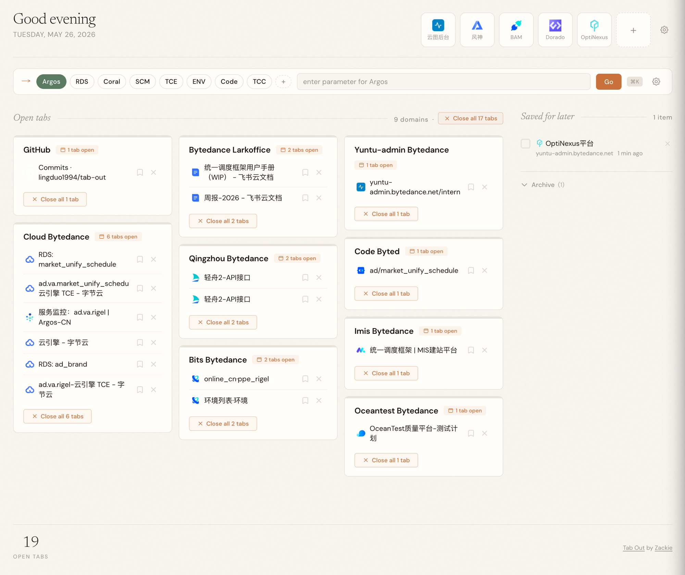

<div align="center">

# Tab Out

**Keep tabs on your tabs.**

A pure Chrome (Manifest V3) extension that replaces your new tab page with a tidy dashboard of every tab you have open — grouped by domain, sorted to focus, and one click away from cleanup.

[English](./README.md) · [简体中文](./README_zh-CN.md)



</div>

---

## Highlights

- **Pinned tiles** — keep up to 10 frequently-visited sites in the header for one-click access, manageable from a side drawer.
- **Quick Jump** — define URL templates (e.g. `https://cloud.example.com/rds/{}/detail`) as chips, type a parameter, hit Enter. Each chip remembers your last 3 parameters in an inline dropdown.
- **Saved for later** — bookmark tabs into a checklist column, archive completed ones into a collapsible section, sweep the archive clean with a single button.
- **Per-domain cards** — every open tab grouped under its domain card with one-click jump, close-single, close-all, and duplicate detection.
- **Local-only** — every byte of state lives in `chrome.storage.local`. No server, no telemetry, no account.

---

## Install

There is no build step. You load the `extension/` folder straight into Chrome.

```bash
git clone https://github.com/lingduo1994/tab-out.git
```

1. Open `chrome://extensions`.
2. Enable **Developer mode** (top right toggle).
3. Click **Load unpacked** and select the `extension/` folder inside the cloned repo.
4. Open a new tab.

> After editing any file under `extension/`, click the reload icon on the Tab Out card in `chrome://extensions`, then reopen the new tab.

---

## Features in detail

### Dashboard layout

The new tab page is the dashboard. Open tabs are bucketed in this priority:

1. **Homepages card** — landing pages of high-traffic apps (Gmail inbox, X home, GitHub home, LinkedIn home, YouTube home, plus anything in your `LOCAL_LANDING_PAGE_PATTERNS`) are pulled into a synthetic "Homepages" card at the top.
2. **Custom groups** — your `LOCAL_CUSTOM_GROUPS` rules (e.g. merge every `*.bytedance.net` subdomain into one card) take effect next.
3. **Domain default** — everything else is grouped by hostname, sorted by tab count descending. `file://` URLs collapse into one `local-files` card.

Each card shows tab chips with favicons, supports overflow (`+N more` expand), and exposes per-tab Save / Close actions plus per-card Close-all and duplicate cleanup.

### Pinned sites

A row of pinned tiles lives in the header (max 10). Each tile shows the favicon and opens in a new tab on click. Drag to reorder; manage (add / edit / delete) through the gear button next to the row.

### Quick Jump + parameter memory

Below the header sits a chip selector — your saved search templates. Each template is a URL with one or more `{}` placeholders. Click a chip, type the parameter, hit Enter (or click **Go**) and you're there. The last parameter you used per template is remembered (up to 3 entries, MRU) and shown in a dropdown as you focus the input.

Shortcuts:

| Shortcut | Action |
|---|---|
| `Cmd/Ctrl + K` | Focus the Quick Jump input |
| `Cmd/Ctrl + 1` … `Cmd/Ctrl + 5` | Pick the 1st-5th chip |
| `Enter` (in input) | Submit the jump |
| `Esc` | Close any open drawer |

### Saved for later

Hover a tab chip, click the bookmark icon, the tab moves into the "Saved for later" checklist on the right. Tick an item to archive it; click the `Archive (N)` toggle to expand archived items. Use the search field inside the archive to filter; click **Clear archive** to sweep all archived items in one go (with a confirmation).

### Duplicate detection

If two tabs share the same exact URL, both chips get an amber `(2x)` badge and the card surfaces a "Close N duplicates" action. Open multiple Tab Out tabs themselves? A top-of-page banner offers a one-click "Close extras".

### Per-card actions

- **Close one tab** — `×` on the chip
- **Save one tab** — bookmark icon on the chip
- **Close all tabs in this card** — footer button (uses hostname match, or exact-URL match for the Homepages / custom-group cards so unrelated tabs on the same hostname are not touched)
- **Dedupe** — "Close N duplicates" keeps the most recently used copy

---

## Configuration (optional)

Create `extension/config.local.js` (gitignored, so it never gets pushed) to pre-seed pinned sites, search templates, and grouping rules.

```js
const LOCAL_LANDING_PAGE_PATTERNS = [
  { hostname: 'mail.example.com', pathExact: ['/'] },
  { hostnameEndsWith: '.notion.so', pathPrefix: '/' },
];

const LOCAL_CUSTOM_GROUPS = [
  { hostnameEndsWith: '.example.net', groupKey: 'work', groupLabel: 'Work' },
];

const LOCAL_PINNED_SITES = [
  { title: 'GitHub', url: 'https://github.com' },
];

const LOCAL_SEARCH_TEMPLATES = [
  { label: 'RDS', urlTemplate: 'https://cloud.example.com/rds/{}/detail' },
];
```

`LOCAL_LANDING_PAGE_PATTERNS` and `LOCAL_CUSTOM_GROUPS` are read on every render. `LOCAL_PINNED_SITES` and `LOCAL_SEARCH_TEMPLATES` are **seed-only** — copied into storage on first run when the corresponding key is empty. Afterwards, edits go through the UI.

A starter template is checked in at [`extension/config.local.example.js`](./extension/config.local.example.js).

### Export / Load from the UI

Inside both the Pinned and Quick Jump manage drawers, a **Config file** section provides:

- **Export to `config.local.js`** — downloads a `config.local.js` mirroring your current pinned sites and search templates. Drop it back into `extension/config.local.js` to bake the snapshot into the source tree.
- **Load from `config.local.js`** — reads the currently-loaded `config.local.js` (the one bundled with the extension at load time) and **overwrites** pinned + templates in storage. Template parameter history is cleared because template IDs are regenerated.

This makes it easy to back up after a configuration session, ship the same setup to another machine, or rebuild after `chrome.storage.local` is wiped.

---

## How it works

| Layer | Implementation |
|---|---|
| Extension | Chrome Manifest V3, three permissions: `tabs`, `activeTab`, `storage` |
| Storage | `chrome.storage.local` (no sync, no server, no telemetry) |
| Layout | CSS `columns` masonry for the dashboard; flex / grid for header and drawers |
| Sound | Web Audio API — the "tab closed" swoosh is synthesized at runtime |
| Animations | CSS transitions + a tiny home-grown confetti particle system |

The entire app is a single `extension/app.js` plus `index.html` / `style.css`. No bundler, no transpiler, no build step. Reload the unpacked extension and you see your edits.

---

## Credits

Originally created by [**Zara Zhang**](https://github.com/zarazhangrui) — upstream at [zarazhangrui/tab-out](https://github.com/zarazhangrui/tab-out).

This fork is maintained by [**Zackie**](https://github.com/lingduo1994) at [lingduo1994/tab-out](https://github.com/lingduo1994/tab-out).

---

## License

MIT
